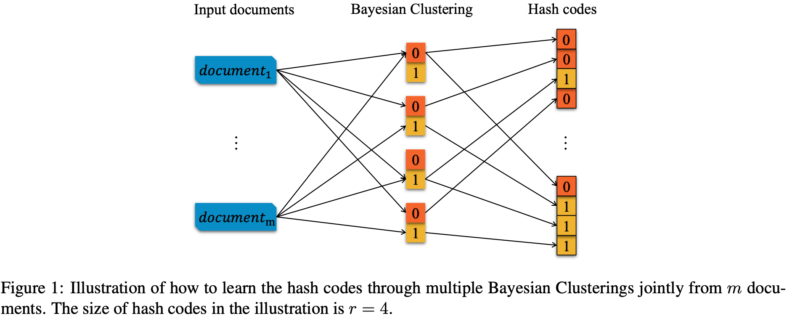
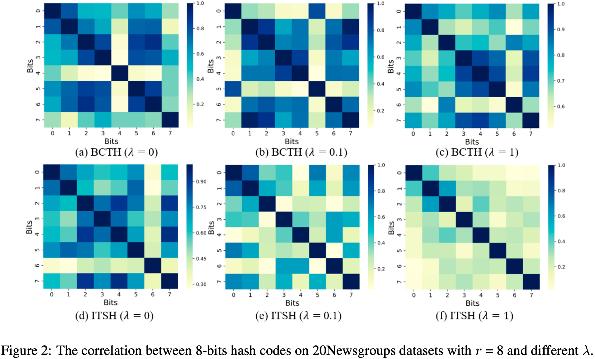
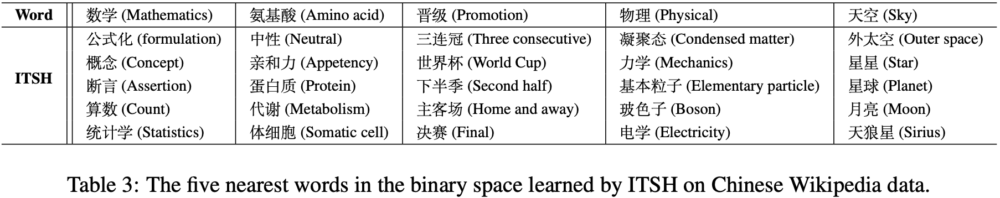

# **语义哈希（Semantic Hash）**
语义哈希是一种离散向量表示方法，通过将数据从原始空间映射到低维(64bits)二进制空间，解决大规模数据下近邻检索面临的存储开销大、计算复杂度高、维度灾难等问题. 

这里我们首次提出BCTH: A Novel Text Hashing Approach via Bayesian Clustering，通过贝叶斯聚类学习文档的二进制表示、同时引入code balance来保证二进制码的高质量. 然而，BCTH中code balance限制了算法的性能(难以处理亿级别训练数据). 因此，提出ITSH: Iterative Semantic Hashing，按位(bit)交替迭代学习二进制码，在每一位二进制码学习过程中建模code balance. 相对BCTH，ITSH在算法性能和高质量二进制码上有显著提升. 同时，我们发现语义哈希能学习到语义相近的词具有相近的二进制表示，对此我们也在探索词的哈希表示(word2hash).

### BCTH: A Novel Text Hashing Approach via Bayesian Clustering



### ITSH: Iterative Semantic Hashing





## 环境
python3

sklearn 0.24.2

scipy 1.5.4

jieba 0.42.1

## 数据
**测试数据:** ./data/query_all_sub

**中文wiki数据:** 链接: https://pan.baidu.com/s/1YTvSCA38O9q2Sknqk0gfzg?pwd=h7te 提取码: **h7te**

## 使用
```
sh run.sh

## 训练
python3 SemHash.py ./data/query_all_sub 10 10000 32 5 $task_name ## 训练样本，关键词数，词表大小，哈希码长度，迭代次数，任务名

##输出文档哈希码
python3 demo_doc_code.py $task_name > ${task_name}_code

##输出测试文档的相似文档
python3 demo_doc_sim.py $task_name > ${task_name}_sim

## 输出文档的哈希码簇
python3 demo_cluster.py $task_name > ${task_name}_cluster

## 输出词的哈希码、词的相似关系
python3 demo_show_model.py $task_name > ${task_name}_model
```

## 效果
#### ----哈希index：哈希码@簇下数据量----
----747264068:10100011101111111110110001000100@412----
| 哈希码index       | 原数据 |
| ----------------- | ------ |
| 2747264068 | 三亚 到底在哪儿 |
| 2747264068 | 三亚 哪个省 |
| 2747264068 | 三亚 在哪个省 |
| 2747264068 | 三亚 属于那个省 |
| 2747264068 | 三亚 崖州机场 | 
----3344118251:11000111010100110011000111101011@383----
| 哈希码index       | 原数据 |
| ----------------- | ------ |
| 3344118251 | 58同城上市什么时间 |
| 3344118251 | 58同城上市多少年了|
| 3344118251 | 58同城上市时间 |
| 3344118251 | 58同城什么时候上市的 |
| 3344118251 | 58同城哪一年上市 |
| 3344118251 | 58同城啥时候上市的 |

#### 单词 相似单词:相似度 [wiki训练数据]

一一对应    下界:64,不动点:64,乘法:64,代数:64,值域:64,偏序:64,公理:64,加法:64,半群:64,可微:64,可数:64,可测:64,可积:64,同伦:64,基数:64,多项式:64

一院制  两院制:62,小党:62,国民议会:60,欧洲议会:60,立法机关:60,立法机构:60,两院:58,代表制:58,众议院:58,党籍:58,制宪会议:58,执政党:58,绝对多数:58

丁烷    丁基:64,丙烯:64,丙烷:64,丙酮:64,乙基:64,乙炔:64,乙烯:64,亚胺:64,产率:64,亲核:64,亲电:64,催化剂:64,制取:64,制备:64,加成:64,加成反应:64,化学式:64

望远镜  光谱学:64,哈伯:64,哈勃:64,射电:64,惠更斯:64,类星体:64,脉冲星:64,中子星:62,候选者:62,倾角:62,共振:62,卡西尼:62,吸积:62,太阳黑子:62,干涉仪:62

牙齿    下颌:64,前肢:64,嘴部:64,头冠:64,脊椎:64,颈椎:64,颌部:64,骨头:64,鳞甲:64,鼻部:64,上颌:62,上颌骨:62,冠饰:62,前段:62,双足:62

七七事变    抗日:62,东北军:60,中央红军:60,中央苏区:60,九一八事变:60,八路军:60,冀东:60,北伐战争:60,华北:60,国共:60,抗日战争:60

曹操    不下:64,之众:64,之策:64,公孙瓒:64,关羽:64,军粮:64,刘备:64,刘牢之:64,刘璋:64,刘表:64,刘邦:64,吕布:64,吕蒙:64,周勃:64,周瑜:64

| 单词              | 相似单词 |
| ----------------- | ----- |
|一一对应 | 下界:64, 不动点 |
|xxx | xxx |
|xxx | xxx |
## 文献
